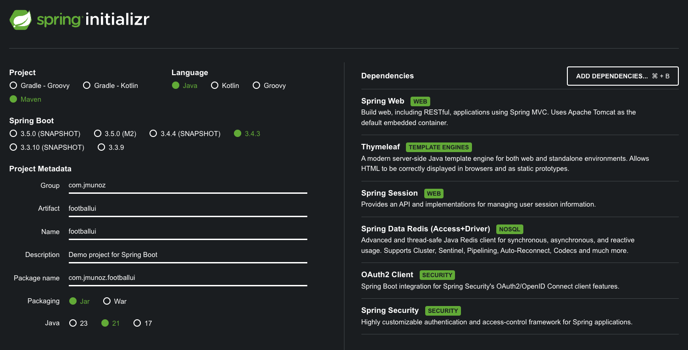

# SPRING BOOT 3 COOKBOOK

Configurando una aplicación MVC con autenticación OpenId.

Se usa `Spring Boot`, `Thymeleaf`, `Spring Web`, `Spring Session`, `Spring Data Redis(Access+Driver)`, `OAuth2 Client` y `Spring Security`.

## Creación de proyecto

Uso Spring Initializr: `https://start.spring.io/`



## Ejecución del proyecto

- Clonar/descargar este proyecto
- Ejecutar el proyecto del Authorization Server
    - `https://github.com/JoseManuelMunozManzano/Spring-Boot-football-auth`
    - Ver su README.md, la parte con título `Configurando una aplicación MVC con autenticación OpenId`.
- Ejecutar el proyecto de Resource Server
  - `https://github.com/JoseManuelMunozManzano/Spring-Boot-football-resource`
  - Ver su README.md, la parte con título `Configurando una aplicación MVC con autenticación OpenId`.
- Ejecutar este proyecto con el comando: `./mvnw spring-boot:run`
  - O ejecutar directamente desde IntelliJ Idea
- Acceder, en el navegador, a la siguiente ruta: `http://localshot:9080`
  - Pulsar en el enlace `who you are`. Esto nos lleva a la pantalla de login
  - Indicar usuario (user) y contraseña (password). Esto nos lleva a la pantalla de consentimientos requeridos (a mi no me sale)
  - Después nos aparece lo que podemos ver en la data OpenId
  - Si pulsamos el enlace Teams aparecen los teams que hay en nuestro Resource Server.

## Configuración

Hay una incompatibilidad conocida entre `Thymeleaf` y `Spring Security`.

Para integrar ambos componentes es necesario añadir esta dependencia, aunque me la añadió automáticamente al crearse el proyecto:

```xml
<dependency>
    <groupId>org.thymeleaf.extras</groupId>
    <artifactId>thymeleaf-extras-springsecurity6</artifactId>
</dependency>
```

Como estamos usando el enfoque Model View Controller (MVC) crearemos un controller que rellenará un modelo y se presentará en la vista. La vista se renderiza usando el motor de plantillas Thymeleaf.

Creamos el paquete `controllers` y dentro el controlador `FootballController.java`, cuyos métodos devuelven el nombre de la vista a renderizar.

Para la vista, creamos una plantilla Thymeleaf en la carpeta `resources/templates`, llamada `home.html`.

Tiene una enlace que queremos proteger.

Configuramos la aplicación para que pueda autenticarse usando nuestro Authorization Server.

Para ello configuramos el cliente Oauth2 en `application.yml`. Necesitaremos los parámetros que usamos en el Authorization Server. 

Configuramos la aplicación para proteger todas las páginas salvo `home` y usamos las credenciales de login OAuth2.

Para ello creamos el paquete `config` y el archivo de configuración `SecurityCon`figuration.java`.

Creamos otra vista en la carpeta `resources/templates`, llamada `myself.html`.

Ahora, en el proyecto `https://github.com/JoseManuelMunozManzano/Spring-Boot-football-resource` tenemos que permitir que la audiencia acceda a la API RESTful.

Por último, necesitamos configurar Redis. Para ello solo necesitamos `hostname` y `port`. Esto lo añadimos a `application.yml`.

Y, por último, para evitar problemas de puertos, ya que para ejecutar esta app hace falta ejecutar otros dos proyectos, haremos, en `application.yml` que el puerto de esta app sea la `9080`.

Tener en cuenta que este puerto en el mismo indicado en el proyecto de `Authorization Server` y que si lo cambiamos aquí, tenemos que poner el mismo puerto en ese otro proyecto.